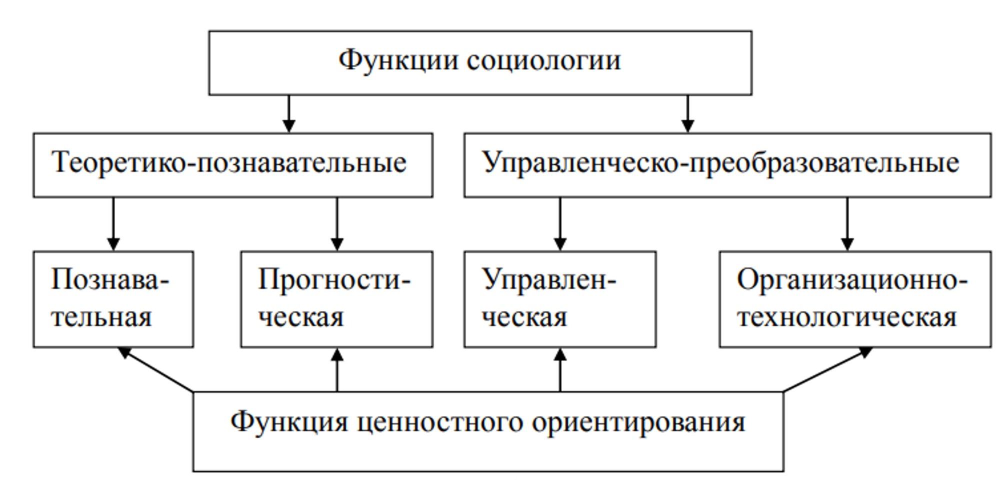

# Социология

## Лекция 1. Социология. Введение в дисциплину “Социология”

### План

1. Предпосылки возникновения возникновения социологии как самостоятельной общественной науки.
2. Объект-предмет социологии. Структура современной (!) социологии.
3. Место социологии в системе современного знания. Функции социологии (какая польза).

Социология (перев.) - наука об обществе.

Впервые в оборот само слово вышло в 1839 г., когда Огюст Конт (философ и социолог). Он известен как основатель “позитивизма”, заодно является и основателем социологии.

В 1839 г. вышел третий том его работы “Курс позитивной философии”, где он впервые использовал термин “социология”.

О. Конт сформулировал закон “О трёх последовательных стадиях интеллектуального развития человека в обществе:

1. теологическая (религиозная): человек объясняет на основе действий сверхъестественных сил (боги, духа и др.) Это знание! Но это знание нельзя проверить на практике. Никто ещё не доказал, что такие силы существуют. Доказать наличие таких существ очень проблемно. Поэтому это знание (с точки зрения Конта) нельзя считать научным.
2. метафизическая (философская): люди отказываются от веры и начинают объяснять окружающий мир каками-либо абстрактными сущностями.
3. позитивная (положительная): люди (прежде всего учёные) начинают констатируют те факты, которые можно увидеть, доказать. Это и есть наука. Конта натолкнуло на мысль (что, научное подвергнуто доказательству) то, что большое количество доказательств, открытий, было сделано с помощью такого подхода.

Он решил классифицировать науки по нескольким критериям: по истории (время), логическому (абстракции), сложности (необходимость изучения более простых), связи с практикой.

По истории:

1. Первой по Конту была математика.
2. Астрономия.
3. Физика.
4. Химия.
5. Биология.
6. Социология. По конту непосредственно связана с практикой, связана с достижением других наук.

Каждая следующая наука опирается на знания предыдущих наук и создаёт что-то своё. Сложность социологии заключается в том, что, изучая социальные процессы, мы не можем не учитывать, что на них не влияют и математические, и астрономические, и физические влияния. Конт, собственно, ничего не сделал для практического изучения общества. И понадобилось ещё много времени, чтобы социология получила звание “наука”.

#### Классический этап (с 30х г. XIX в — начало 20х гг. XX в.)

Разработка категориального аппарата (слова, термины).

Важнейшие понятия любой науки — объект и предмет.

Отличия:

| Объект                                                | Предмет                                                                              |
| ----------------------------------------------------- | ------------------------------------------------------------------------------------ |
| 1. Полная независимость от науки.                     | 1. Определяется теми связями и отношениями, которое открыты и изучены данной наукой. |
| 2. Один и тот же объект изучают сразу несколько наук. | 2. Характеризуют специфику науки, и у каждой должен быть собственная.                |

Социальная общность — большая или малая группа людей, занимающих одинаковое социальное положение (статус) и имеющих общие социальные признаки.

Социальное положение (!) измеряется относительно того, с кем можно сравнить.

Почему-то оказывается, что у людей одинаковые взгляды, мысли и т.д. Почему? Оказывается, что из-за похожего статуса в обществе.

Социальные признаки с точки зрения социологии:

1. Потребности (я хочу кушать).
2. Интересы (что я хочу кушать).
3. Взгляды.
4. Мнение.
5. Ценности.

Всё это зависит от статуса, социального положения. У пенсионеров одно мнение, у молодёжи — другое. И так далее.

В социологии: Объект - общество как система социальных отношений. Предмет - законы становления, развития и функционирования общества. Их мы находим через социальные признаки. Через них можно вывести какие-либо законы.

Законы отличаются от физических и технических законов. Они выступают как **законы-тенденции**. Здесь \[в социологии] слишком много факторов, из-за чего законы могут меняться. Тенденции - направление изменения.

### Структура

**Структуру** современной социологии можно представить как **трёхуровневой модели:**

* теоретическая социология;
* социология отраслевых теорий (отраслевая);
* социология конкретного исследования. (?)

#### Первый уровень

* Теории наивысшего уровня.
* Их эмпирическую базу составляют данные конкретных исследований.
* Теоретическая социология занимается также разработкой методов исследования и методологией исследовательского процесса. Вторая лекция будет говорить о методах.

#### Второй уровень

* Обобщают и структурируют эмпирические данные в пределах отдельных областей социологического знания.

#### Третий уровень

* Здесь происходит сбор и анализ социальной информации.

Есть также деление на макро- и микросоциологию.

Макропроцессы: взаимодействие между большими общностями людей.

Микро-: с более мелкими группами. Пример: студенческая группа.

### Функции социологии

<figure><figcaption></figcaption></figure>

Познавательная функция — первая функция.

Её продолжение — прогностическая функция: может трёх основных формах.

Функция ценностного ориентирования (в литературе - идеологическая функция). Но такое название лучше отражает суть действия.

#### Прогностическая функция:

Формы прогностической функции:

1. Социальное проектирование - разработка конкретной модели социального процесса или социальной системы с чётко заданными параметрами. Здесь можно что-то спрогнозировать в актуальных процессах жизни.
2. Социальное конструирование - создание “математической модели” развития типичного социального явления или процесса, где параметры можно изменять (конструировать).
3. Социальное планирование - разработка целевых комплексных программ развития отедельных сфер общественной жизни. Когда разваливался СССР, все его рушили. А вы покажите хотя бы одного предпринимателя на западе, который не планирует будущее своего бизнеса. Никто не предоставим Вам деньги без разработанного плана Вашего бизнеса. Никогда никакой план не будет в полной мере реализован, но он помогает видеть, что нужно делать на разных стадиях. Он показывает направление развития.

#### Управленческая функция:

Директор + ресурсы. На каждые ресурсы есть ответственные за них люди.

Выводы, рекомендации, предложения социологов могут тать основанием для выработки и принятия управленческих решений.

Институт социологии провёл какой-то опрос по поводу Всенародного собрания и оказывается у нас большая часть населения очень плохо относятся к этому органу. Но, кажется, у А. Г. Лукашенко негативное отношение к нему. Но ему сказали, что народ хочет есть видеть.

#### Организационно-технологическая функция

Результаты исследования социологов представляются в виде рекомендаций, предложений, методик, социальных технологий.

Социальная технология — это программа преобразовательной деятельности и сама деятельность на основе этой программы, призванная в корне изменить ситуацию.

#### Функция ценностного ориентирования (идеологическая функция)

Учёные-социологи ориентируют людей на следование определённым ценностям.

Пример: вот придумали термин “Красный пояс” - там желающие голосовать за коммунистов. Что говорили те, кто ориентировался на Ельцина: “Вот красный пояс. А что там? Там захудалые деревни и вот они любят коммунистов. А вот развитые регионы будут выбирать Ельцина”. Говорят о товаре, который якобы популярен у другой группы общества. Это и есть ориентирование.

## Лекция 2. Возможности эмпирического социологическаго исследования общества

Вопросы:

* социологическое исследование и его виды
* методы сбора социологической информации
* программа социологического исследования
* методика техника процедура социологического исследования

Социологическое исследование — это система логически последовательных методологических, методических и организационно-технических процедур, связанных между собой единой целью: получить обхективные, достоверные данные об изучаемом явлении или процессе для их последующего исрользования в практике социального управления.

Этапы социологического исследования:

* Подготовка исследования
  * Разработка программы исследования
  * Подготовка интструментария
  * Родготовка участников исследования
* Сбор первичной информации
* Подготовка собранной информации к обработке и её обработка (вручную или на ЭВМ) (Выбраковка)
  * Проверка на точность, достоверность
  * Убрать неточности
  * Количественные обсчеты в таблицах распределения
* Анализ обработанной инфомации, формулировка выводов и практических рекомендаций

**Референс**

| 1. Масштабности и сложности                                                                                                                                                                                                                                  | 2. Направленность                                                                                                                | 3. Статики или динатики изучаетого явления                                                                                      |
| ------------------------------------------------------------------------------------------------------------------------------------------------------------------------------------------------------------------------------------------------------------ | -------------------------------------------------------------------------------------------------------------------------------- | ------------------------------------------------------------------------------------------------------------------------------- |
| 1.1 Разведывательное(зондажное, пилотажное) — это самый простой вид исследования, когда про объект мы ничего не знаем, проводится по упрощенной программе.                                                                                                   | 2.1 Теоретическое — направлены на формирование специальных социологический теорий                                                | 3.1 Разовое — дает инфомацию о состоянии и количественных характеристиках какого-либо объекта                                   |
| 1.2 Описательное — это более глубокий социологический анализ. Объектом исследования выступает достаточно большая и неоднородная обзность людей. Проводится по полной, подробно разработанной программе и на базе методически апробированного инструментания. | 2.2 Теоретическо-практические — ориентированы на специальные социлогически теории с возможным выхододм в управленческую практику | 3.2 Повторное — основано на единой программе и инструментарии. Проводится последовательно через определенные промежутки времени |
| 1.3 Аналитическое — сатый сложный и глубокий вид социологического исследования. Предполагает выявление причин тех или иных явлений, их динамику и т.д. Носит компленсный характер как по методам сбора инфомации, так и по другим показателям                | 2.3 Практико-теоретическое — ориентированы на решение прикладных задач с возможным выходом в теорию                              | 3.2.1 Панельное                                                                                                                 |
|                                                                                                                                                                                                                                                              | 2.4 Практическое — напрвалены на получение информации для прямого использования в системе социального управления                 | 3.2.2 Трендовое                                                                                                                 |
|                                                                                                                                                                                                                                                              |                                                                                                                                  | 3.2.3 лонгитюдное                                                                                                               |

Методы сбора информации:

* социологический опрос (занимает самое большое место, дает до 90% информации)
  * специализированный (экспертные) — профессионалы в своем деле.
  * массовый — непрофессионалы в сфере, но могут иметь мнение. Те, кого мы опрашиваем — респонденты.
  * анкетирование — это когда ответы фиксирует тот, кто отвечает
    * заочное
    * очное — шансы получить ответы больше, чем при заочном
      * групповое
      * индивидуальное
  * интервьюирование — это когда ответы фиксирует тот, кто задает (стандартизированне, полустандартизированное, нестандартное)
    * прямое: тет-а-тет
    * опосредованное
* Социометрический опрос (социометрия) — метод выявления междичностных отношений в группах и коллективах с помощью процедуры выбора желательных и отклонения нежелательных партнеров для совместной деятельности. Должна быть группа. Группа должна контактировать. Лидерство - тоже вопрос межличностных отношений. По результатам исследований человека, которого все не любят, сделали лидером - работа стала лучше.
* Изучение документов — позволяет получить сведения о прошедших событиях, наблюдение за которыми уже невозможно.
  * Контент-анализ — метод извлечения инфомации из больших текстовых массивов с помощью выделения смысловых единиц, к которым относятся определяется
* Cоциологическое наблюдение — целенаправленное и систематизированное восприятие кокогго либо явления черты свойства и особенности которого фиксируются исследователем
  * не включенное
  * включенное
    * открытое
    * скрытое
* Социологические тесты — позволяют выявить латентные, скрытые свойства изучаемых объектов (личности и группы)
* Эксперимент — скорее не метод, а форма организации социологического исследования. Он обычно используется для проверки на практике теоретических расчетов.
  * Полевые и лабораторные
  * Линейные(одна и таже группа) и параллельные(как миниму две группы, которые сравниваются)

Программа социлогического исследования — это документ, в которм излагаются методологические, методические и организационные принципы будущего исследования, описываются приемы и средслва изучения определенного явления или процесса.

Функции: …

Разделы: …

Генеральная совокупность — весь объект, на который распространяются выводы исследования, т.е. круг людей с заданным социальным признаком.

Выборочная совокупность — отобранное по строго заданному правилу число элементов генеральной совокупности, подлежащее непосредственному исследованию.

Единицы анализа — элементы выборочной или абследуемой совокупности. Ими могут быть как индивиды, так и целые группы.

Методы: …

Репрезентативность выборки — выборочная совокупность должна воспроизводить параметыр и значимые элементы структуры генеральной совокупности

## Лекция 3. Общество как социальная система

Разбираем предмет социологического анализа макро уровня. Используется системный подход.

1. Понятия социальной системы и мипология социальных систем
2. Социальнаые институты и их роль в жизни общества
3. Социальная структура: социальный статус и социальная стратификация

Социальная система - это целостное образование, основныыми элементами которого являются люди, из связи, взамидействия и отношения.

Целостная система отличается от суммарной, тем что ее нельзя разделить на части.

Входят только связи и взаимодействия носящие системный характер.

Признаки общества как социальной системы:

* Объединение не является частью какой-либо более крупной системы (общества)
* Браки заключаются (премущественно) между представителями данного объединения
* Оно пополняется преимущественно за счет детей тех людей, которые уже являются его признанными представителями
* Объединение имеет территорию, которую считает своей собственной
* У него есть собстенное название и своя история
* Оно обладает собственной системой управлеия (суверенитетом)
* Объединение существует дольше стредней продолжительности жизни отдельного индивида
* Его объединеяет общея система ценностией (обычаев, тредиций, норм, законов, правил, нравов), которую называют культурой

Страна - часть света или территории, которая имеет определенные границы и пользуется государтсвенным суверенитетом.

Государство - политическая организация данной страны.

Общество - социлаьная организация данной страны, основой которой является социальная структура.

Субъекты социальной системы:

1. Индивиды
2. Социальные общности
3. Социальные институты

Виды социальныз отношений:

1. Экономика
2. Идеология
3. Политика

Основные характеристики социальной стстемы конкретного общества:

1. Социально-этнические
2. Социально-демографические
3. Социально-территориальные
4. Социально-профессиональные
5. Социокультурыные

Типология социальных систем:

1. По наличию письменности
   1. дописьменные
   2. письменные
2. По числу уровней управления и степени социальной дифференициации
   1. простые
   2. сложные
3. По способу производства
   1. охотников и собирателей
   2. скотоводов и огородников
   3. земледельчесокие
   4. индустриальные
   5. постиндустриальные
4. По способу производства и форме собственности
   1. первобытные
   2. рабовладельческие
   3. феодальные
   4. капиталистические
   5. коммунистические

Синтезированная модель Данниела Белла:

1. Доиндустриальная
2. Индустриальные
3. Постидустриальные

Социальные институты - исторически сложившиеся устойчивые формы организации совместоной деятельности людей

Каждый социальный институт имеет свою цель - круг групповых или общественных потребностей, на которые направлена деятельность института

По характеру органиции различают:

1. формальные институты
2. неформальные институты

Каждый социальный институт включает в себя:

1. Определенную сферу деятельности
2. Группу лиц, уполномоченных для выполнения тех или иных функций
3. Организационные нормы и принципы отношений
4. Материлаьные средства, необходимые для решения поставленных задач

Классификаци социальных институтов по их функциональным качествам:

1. Экономико-социальыне
2. Политические
3. Социокультурыне и воспитательные
4. Нормативно-ориентирующие
5. Нормативно-санкционирующие
6. Церемониально-символические и ситуационно-конвенциональные

Дисфункция социального института - нарушение номативного возаимодействия с социальной средой, в кочестве которого выступает общество или сообщество.

Аномия - переходный период в развитии общества, когда оно сталкивается с дезорганизацией практически всех традиционных институтов.

виды социльных общностей

1. социальные группы
   1. большие, средние, малые
   2. Фомальные, неформальные
2. Социальные классы
   1. высший, средний, низший …

Социальный статус - это положение, занимаемое человекам или группой в обществе и связанное с определенными правами и обязанностиями.

Виды статусов:

1. Личный
2. Социальный
3. Главный
4. Предписанный
5. Достигаемый

Статусный набор - совокупность всех статусов, принадлежающих одному индивиду

Социальная стратификация - это расположение людей в статусной иерархии сверху вниз
